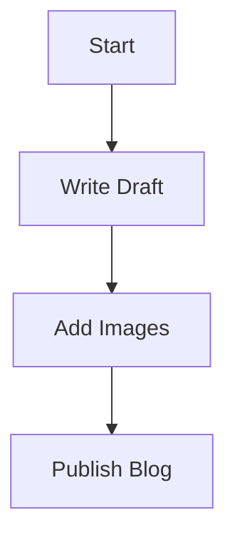
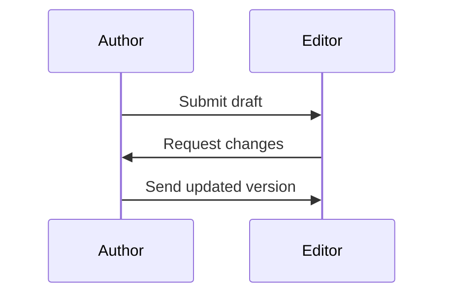
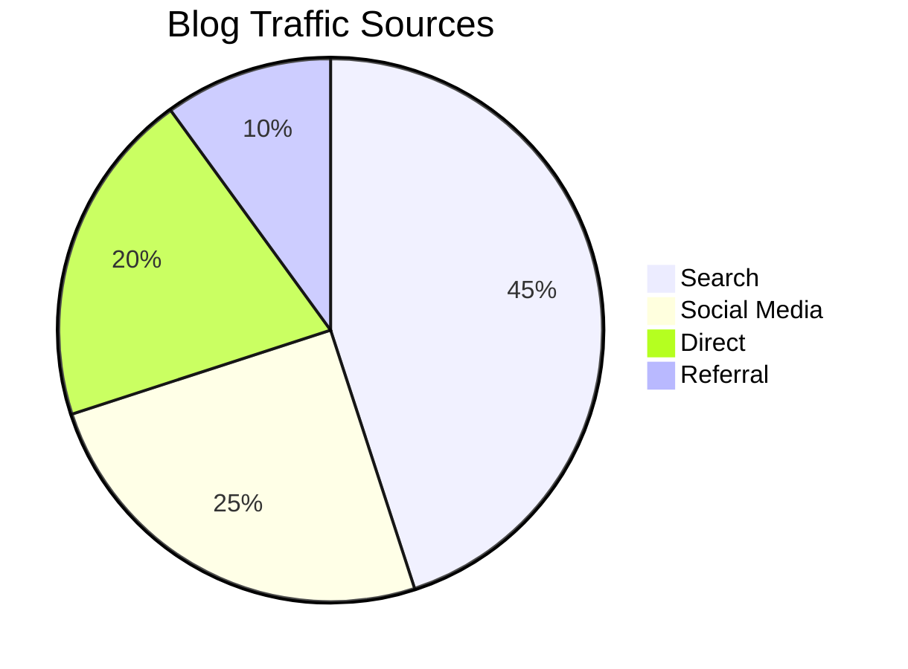
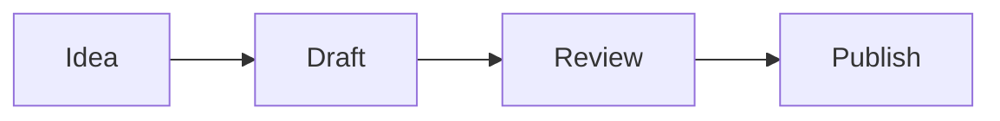

# Markdown Blog Cheat Sheet

Use this cheat sheet when writing a Markdown-based blog post.

## 1. Headings

```md
# Blog Title
## Section Title
### Subsection Title
#### Small Heading
```

## 2. Paragraphs and Line Breaks

```md
This is a normal paragraph in Markdown.

This starts a new paragraph.
```

## 3. Text Formatting

```md
**Bold text**
*Italic text*
***Bold and italic***
~~Strikethrough~~
`Inline code`
```

## 4. Lists

### Unordered List

```md
- First item
- Second item
- Third item
```

### Ordered List

```md
1. First step
2. Second step
3. Third step
```

## 5. Blockquotes

```md
> This is a quoted line.
> It can span multiple lines.
```

## 6. Adding Code

### Inline Code

```md
Use the `npm install` command to install dependencies.
```

### Code Block

````md
```js
function greet(name) {
  return `Hello, ${name}!`;
}
```
````

### Code Block With Other Languages

````md
```python
def greet(name):
    return f"Hello, {name}!"
```

```bash
npm run dev
```
````

## 7. Adding Images

### Basic Image

```md

```

### Image With Title

```md

```

### Clickable Image

```md
[](https://example.com)
```

## 8. Adding Videos

Markdown does not have a universal standard for embedded video, so use one of these methods.

### Video Link

```md
[Watch the demo video](https://example.com/demo-video)
```

### Clickable Thumbnail for Video

```md
[](https://example.com/demo-video)
```

### HTML Video Tag

```md
<video controls width="720">
  <source src="videos/demo.mp4" type="video/mp4">
  Your browser does not support the video tag.
</video>
```

### Embedded YouTube Video

```md
<iframe
  width="720"
  height="405"
  src="https://www.youtube.com/embed/VIDEO_ID"
  title="YouTube video player"
  frameborder="0"
  allowfullscreen>
</iframe>
```

## 9. Creating Graphs and Diagrams

Many Markdown blog platforms support Mermaid diagrams.

### Flowchart

````md

````

### Sequence Diagram

````md

````

### Pie Chart

````md

````

If your platform does not support Mermaid, add a graph as an image:

```md

```

## 10. Adding Hyperlinks

### Basic Link

```md
[OpenAI](https://openai.com)
```

### Automatic URL

```md
<https://openai.com>
```

### Link to Another Section

```md
[Jump to Code Examples](#6-adding-code)
```

## 11. Citation and Footnotes

Some Markdown processors support footnotes.

### Footnote Citation

```md
Markdown is widely used for technical blogging.[^1]

[^1]: This statement can be linked to a source or reference note.
```

### Reference List Style

```md
According to recent documentation, Markdown is easy to read and write [1].

## References

[1] John Gruber, "Markdown Documentation", https://daringfireball.net/projects/markdown/
```

## 12. Tables

```md
| Feature   | Supported |
|-----------|-----------|
| Code      | Yes       |
| Images    | Yes       |
| Video     | Sometimes |
| Mermaid   | Depends   |
```

## 13. Horizontal Line

```md
---
```

## 14. Example Blog Snippet

````md
# How to Write a Great Markdown Blog Post

Welcome to this tutorial. In this post, we will add code, images, and references.

## Example Code

```js
console.log("Hello, blog!");
```

## Example Image


## Example Video

[Watch the walkthrough](https://example.com/walkthrough)

## Example Diagram



## Reference

For more details, visit [Markdown Guide](https://www.markdownguide.org/).
````

## 15. Quick Tips

- Always use clear headings.
- Add alt text to images.
- Use fenced code blocks with a language name.
- Test Mermaid diagrams on your blog platform before publishing.
- Use footnotes or a references section for citations.
- Prefer video thumbnails or links if embeds are not supported.
