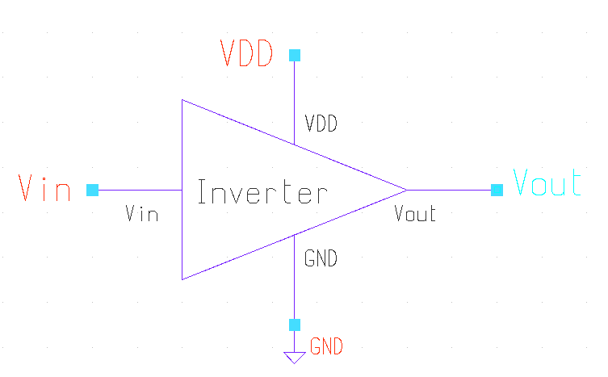
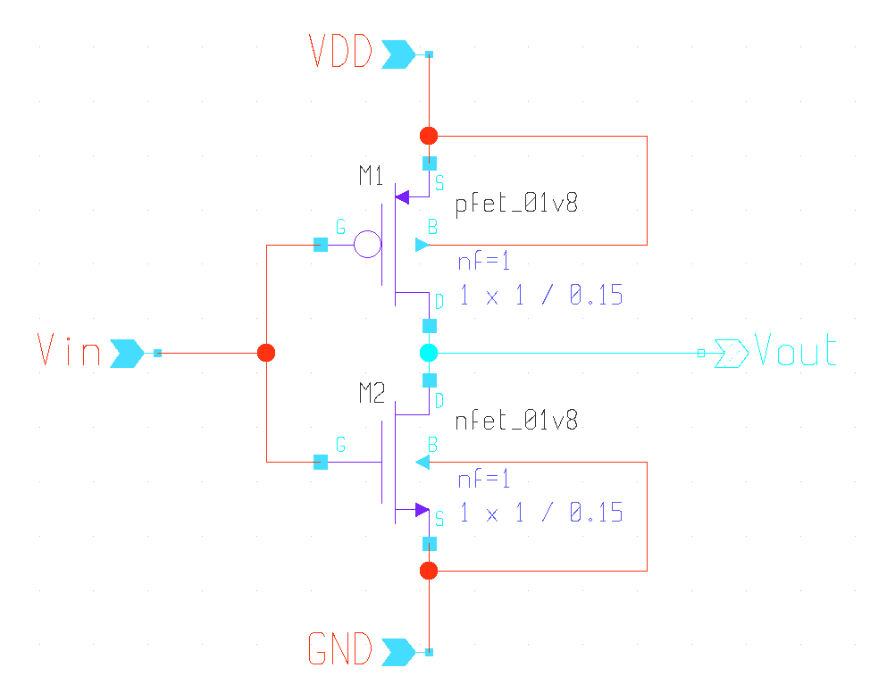
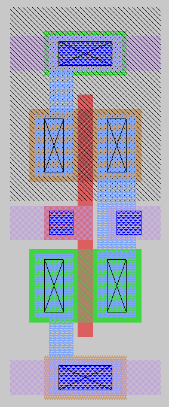

# Liberty File (.lib)

## Introduction

A Liberty (`.lib`) file is a standard cell library description used by synthesis, timing analysis, and physical design tools. It contains timing, power, area, and functional information for each cell in a technology library.

Liberty files are developed by the foundry or library vendor and are one of the primary inputs to digital implementation flows.

---

## Why Liberty Files Are Important

Liberty files provide:

- Cell functionality
- Timing information
- Power information
- Area information
- Pin characteristics
- Operating conditions
- Constraint definitions

Tools such as Fusion Compiler, PrimeTime, Design Compiler, OpenROAD, and Yosys use Liberty files during implementation and signoff.

---

<table>
<tr>
<td align="center">

<br>
Figure 1: Liberty File Structure
</td>

<td align="center">

<br>
Figure 2: Timing Arc
</td>

<td align="center">

<br>
Figure 3: Delay Lookup Table
</td>
</tr>
</table>

## Liberty File in ASIC Flow

```text
RTL
 ↓
Synthesis
 ↓
Gate-Level Netlist
 ↓
Place & Route
 ↓
Static Timing Analysis

      ↑
   Liberty
    (.lib)
```

## Basic Structure

A Liberty file typically contains:

```text
library
├── Operating Conditions
├── Wire Load Models
├── Cell Definitions
│   ├── Pins
│   ├── Timing Arcs
│   ├── Power Data
│   └── Area
└── Constraints
```

## Key Library Attributes

### Technology Information

- Time Unit
- Voltage Unit
- Current Unit
- Capacitance Unit
- Resistance Unit

### Operating Conditions

Example:

```liberty
operating_conditions(TT_0P80V_25C) {
    process : 1.0;
    voltage : 0.80;
    temperature : 25;
}
```

Parameters:

- Process
- Voltage
- Temperature

## Cell Definition

Example:

```liberty
cell(AND2X1) {
    area : 1.25;

    pin(A) {
        direction : input;
    }

    pin(B) {
        direction : input;
    }

    pin(Y) {
        direction : output;
    }
}
```

## Timing Arcs

Timing arcs define delay relationships between input and output pins.

Example:

```liberty
timing() {
    related_pin : "A";
}
```

Common timing arc types:

- Combinational
- Rising Edge
- Falling Edge
- Setup
- Hold
- Recovery
- Removal

## Delay Modeling

Delay depends on:

- Input Transition
- Output Load Capacitance
- Process Corner
- Voltage
- Temperature

Liberty files typically use lookup tables to model delays accurately.

## Power Modeling

Power data includes:

- Internal Power
- Switching Power
- Leakage Power

Example:

```liberty
cell_leakage_power : 0.003;
```

## Common Standard Cells

- Buffer
- Inverter
- NAND
- NOR
- AOI
- OAI
- Multiplexer
- Flip-Flop
- Latch
- Clock Gating Cell

## Library Corners

| Corner | Process | Voltage | Temperature |
|----------|----------|----------|-------------|
| TT | Typical | Nominal | 25°C |
| SS | Slow | Low | High |
| FF | Fast | High | Low |

## Important Sections in a Liberty File

### Library

```liberty
library(my_library) {
}
```

### Cell

```liberty
cell(INVX1) {
}
```

### Pin

```liberty
pin(A) {
}
```

### Timing

```liberty
timing() {
}
```

### Internal Power

```liberty
internal_power() {
}
```

## Usage in Design Flow

| Stage | Usage |
|---------|---------|
| Synthesis | Cell Mapping |
| Placement | Timing Estimation |
| CTS | Clock Optimization |
| Routing | Timing Updates |
| STA | Signoff Analysis |
| Power Analysis | Dynamic and Leakage Power |

## Summary

The Liberty file is one of the most important inputs in ASIC implementation. It describes the functionality, timing, power, area, and constraints of standard cells and enables accurate synthesis, physical design, timing analysis, and power analysis throughout the design flow.