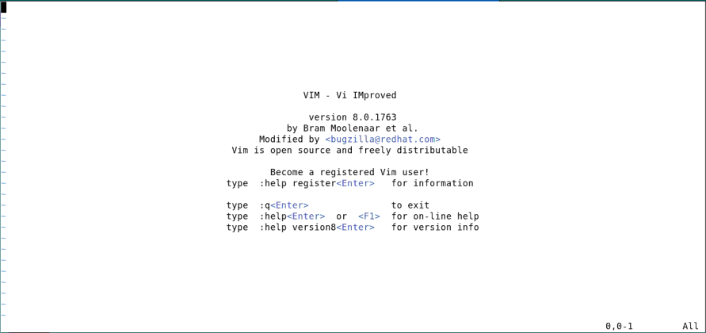
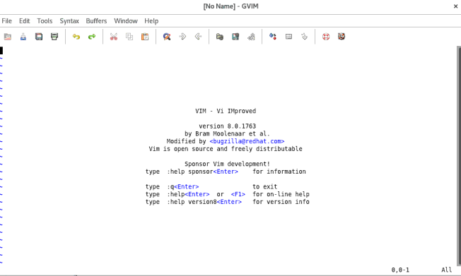
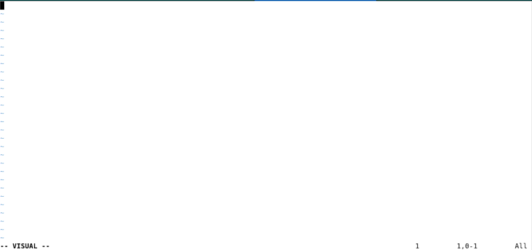
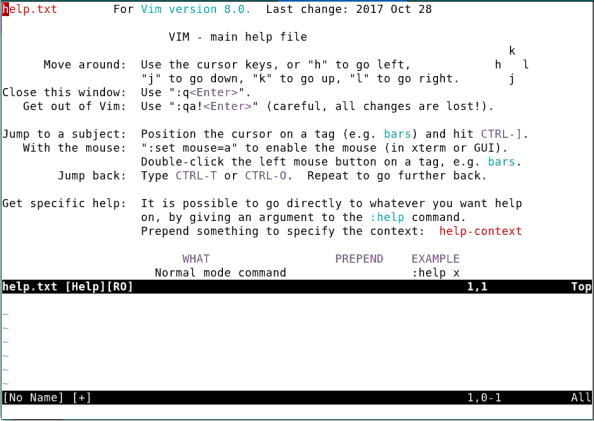

# Vim — Complete Guide

## Introduction

#### Introduction

### History of Vim and GVim

- **Vim (Vi IMproved)** was released by Bram Moolenaar in **1991**, based on the original `vi` editor.
- `vi` was developed in **1976** by Bill Joy for the Unix operating system.
- Vim started as a clone named `stevie` on the Amiga computer.
- Over time, Vim added features like **syntax highlighting**, **macros**, and **scripting**.
- **GVim** introduced a graphical user interface with menus, mouse support, and better color display.
- Vim became the default editor in many Unix/Linux distributions and gained wide popularity among developers.
- Vim is distributed as **charityware**, supporting ICCF Holland (a children's charity in Uganda).
- In 2015, **Neovim** forked from Vim to modernise the codebase, improve plugin support, and add async features.

### Introduction to Vim and GVim

- **Vim** is a highly efficient, versatile, and powerful text editor.
- It is **keyboard-centric**, designed for users who prefer minimal keystrokes and maximum control.
- Vim is a **modal editor**,
  - **Normal Mode**: Default mode for navigation and editing.
  - **Insert Mode**: For inserting and editing text.
  - **Visual Mode**: Used for selecting and manipulating blocks of text.
  - **Command Mode (Ex mode)**: Allows execution of colon-prefixed commands.
- **GVim** is the graphical version of Vim, offering a user-friendly GUI with:
  - Menus, toolbars, and mouse support.
  - Enhanced colour schemes and font customisation.
  - Clipboard integration with the desktop environment.
- Both Vim and GVim share the same powerful engine and are extensively used in programming, system administration, and text processing tasks.

### Why Vim is Powerful and Versatile

- **Modal editing** makes navigation and editing faster.
- Very lightweight and starts instantly.
- Fully configurable using **`.vimrc`**.
- Rich plugin support (e.g., NERDTree, Telescope, Coc.nvim).
- Works smoothly over SSH—ideal for remote servers.
- Strong regex-based search and replace.
- Easy integration with Git, Make, and shell tools.

### Challenges of Using Vim

- **Steep learning curve**.
- Commands must be memorised.
- Initial setup can be time-consuming.
- Not intuitive for beginners.
- Lacks modern IDE features by default.
- Limited mouse support in terminal.
- Plugin management requires manual effort.
- Configuration may break across systems.


## Vim Installation

#### Installation

### Installing Vim and GVim

- **Linux (Debian/Ubuntu)**:
  - `sudo apt install vim`
  - `sudo apt install gvim` (for GUI)
- **Linux (RedHat/Fedora)**:
  - `sudo dnf install vim-enhanced`
  - `sudo dnf install gvim`
- **macOS (Homebrew)**:
  - `brew install vim`
  - `brew install macvim` (GVim alternative)
- **Windows**:
  - Download installer from `https://www.vim.org`
  - Or install via `choco install vim` (using Chocolatey)
- **Optional**: Compile from source for latest features.

### Checking Vim Installation

- Open a terminal or command prompt.
- Run: `vim --version`
  - If Vim is installed, version info will appear.
  - If not, you’ll see a “command not found” or similar error.
- Optional: `which vim` (Unix/macOS) or `where vim` (Windows)
- For GVim, try running `gvim` or check your application menu.

### Running Vim for first time

```
$vim 
```



```
$gvim
```




## Basic Editing

#### Basic Editing

### Modes

- Vim is a **modal editor**. Behavior changes with the mode.
- **Normal Mode**: Default mode (no label or shows filename).
- **Insert Mode**: Shows `--INSERT--` at the bottom.
- **Visual Mode**: Shows `--VISUAL--`.
- To insert text:
  - Press `i` to enter Insert Mode.
  - Type content.
  - Press `Esc` to return to Normal Mode.
- Press `Esc` anytime to return to Normal Mode.




### Inserting and Deleting text

- To insert text:
  - Press `i`, type your text, then press `Esc`.
  - Example: `iA young<Esc>`
- Vim does not wrap lines automatically.
- Press `Enter` to start a new line.
- Press `x` to delete the character under the cursor.
- Example: Move to the start of a line and type `xxxxxxx` to delete 7 characters.

**Before:**
```
intelligent turtle
Found programming UNIX a hurdle
```

**After:**
```
A young intelligent turtle
Found programming UNIX a hurdle
```

### Moving Around

- In Normal Mode, use:

  - `h` – move left
  - `j` – move down
  - `k` – move up
  - `l` – move right

- These keys are on the home row—fast and easy to reach.
- **Avoid arrow keys**—they slow down.
- Frequent hand movement to the arrows reduces efficiency.
- Mnemonics:
  - `h` is left, `l` is right
  - `j` looks like a hook down
  - `k` points up

### Undo and Redo

- Press `u` to undo the last edit.
- Press `u` repeatedly to keep undoing earlier changes.
- Example:

  - `xxxxxxx` deletes `A young`.
  - Pressing `u` restores characters one by one:
`g` → `ng` → `ung` → `young` → `A young`

- Press `CTRL-R` to redo (reverse the last undo).
- Use `U` (uppercase) to undo all changes on the current line.
- Typing `U` again cancels its effect.

### Saving and Exiting

| **Command** | **Description** |
|---|---|
| `:w` | Save file, stay in Vim |
| `:wq` | Save and quit |
| `:wq!` | Force save and quit (e.g., read-only file) |
| `:x` | Save and quit if changes were made |
| `ZZ` | Save and quit (like `:wq`) |
| `:q` | Quit (only if no changes) |
| `:q!` | Quit and discard all changes |

- Press `Esc` to leave Insert Mode and enter Normal Mode.
- Type `:` to enter Command Mode (colon appears at bottom).
- Type the appropriate command (see table below).
- Press `Enter` to execute.

### Insert and Append Commands

**flexible ways to insert text:**

- `i` – Insert **before** the current cursor position.
- `a` – Append **after** the current cursor position.
- `I` – Insert at the **beginning of the line**, no matter where the cursor is.
- `A` – Append at the **end of the line**, regardless of cursor position.

- To insert "Hello" at the start of a line: `IHello<Esc>`
- To append "!!!" at the end of a line: `A!!!<Esc>`
- To insert right before a word: move cursor to the word, type `iText<Esc>`
- To add after a word or character: move cursor, type `aText<Esc>`

### Opening New Lines in Vim

**Insert New Lines Quickly in Normal Mode**

- `o` – Opens a new line **below** the current line and enters insert mode.
  - Example: Place the cursor on a line and press `o`, type text, press `<Esc>`.

- `O` – Opens a new line **above** the current line and enters insert mode.
  - Useful when inserting comments or headers above code.

- After typing the new line, press `<Esc>` to return to Normal mode.

### Getting Help

- Vim has a built-in help system.
- To access it, In normal mode type: `:help` and press `Enter`.
- Opens a new window with general help topics.
- Use it to learn commands, options, and usage examples.
- Navigate help with:
  - `Ctrl-]` – follow a link
  - `Ctrl-o` – go back
  - `:q` – close help window
- For specific topics: `:help <command>`
- Example: `:help :wq` or `:help visual-mode`



### Accessing Help in Vim

**Accessing the Help Screen**

- Press `<F1>` to open the general help screen in Vim.
- If your keyboard has a `<Help>` key, you can press that to open the help.
- Once in the help screen, navigate using Vim's normal commands like `h`, `j`, `k`, and `l`.

**Exiting Help:**
- To exit the help screen, use `ZZ` to save and quit, or `:q!` to quit without saving.

### Summary: Basic Editing

| **Feature** | **Description** |
|---|---|
| Modes | Normal, Insert, Visual – switch using keys like `i`, `Esc` |
| Inserting/Deleting | Use `i` to insert, `x` to delete a character |
| Navigation | Move with `h, j, k, l` instead of arrow keys |
| Undo/Redo | `u` for undo, `CTRL-R` for redo, `U` for line undo |
| Saving/Exiting | Commands like `:w`, `:q`, `:wq`, `:q!`, `ZZ` |
| Insert/Append | Use `i`, `a`, `I`, `A` for different insertion points |
| New Lines | `o` for line below, `O` for line above |
| Help | `:help`, `<F1>`, navigate with `Ctrl-]`, `Ctrl-o`, `:q` |


## Fast Editing

#### Fast Editing

### Using a Count to Edit Faster

**Using Numbers to Speed Up Editing**

- Precede commands with a number to repeat actions:
- `9k` – Move up 9 lines (instead of typing `kkkkkkkkk`).
- `3a!` – Append `!` three times to the end of a line.
- `3x` – Delete 3 characters under the cursor.

**General Rule:**
- Numbers modify most Vim commands. For example, `3dw` deletes 3 words.
- This can significantly speed up your editing process.

### Word Movement

- `w` moves the cursor forward by one word.
- `b` moves the cursor backward by one word.
- Numeric prefixes repeat the movement; e.g., `4b` moves back four words.
- A "word" is defined by Vim based on whitespace and punctuation.
- Uppercase variants like `W` and `B` use different word boundaries (non-whitespace).

### Moving to the Start or End of a Line

- `$` moves to the end of the current line.
- Also mapped to `<End>` and `<kEnd>` (keypad End).
- Numeric argument moves to end of the *n*-th line; e.g., `2$` goes to end of the next line.
- `^` moves to the first nonblank character of the line.
- `0`, `<Home>`, and `<kHome>` move to the first character of the line.
- Numeric prefixes are accepted but ignored by these commands.

### Moving to a Specific Line

- `G` moves to a specific line number when used with a numeric prefix.
- Example: `3G` moves to line 3; `1G` moves to the top of the file.
- Without an argument, `G` moves to the end of the file.
- A workaround like `9999k` followed by `2j` works but is inefficient.
- Useful when responding to compiler errors referencing specific line numbers.

For navigating compiler errors efficiently, see commands like `:make` and `:clist`.

### Line Numbers in Files

- Line numbers help indicate position in the file.
- Use `:set number` to enable line numbering.
- Use `:set nonumber` to disable line numbering.
- The `number` option is Boolean — it can be toggled on or off.
- Line numbers appear on the left, aiding navigation and debugging.
- Often used with commands like `G`, `:3`, or `/pattern`.


### Scrolling Up and Down

- `CTRL-U`: Scrolls up half a screen of text.
- Up means backward in the file (text moves down on the screen).
- `CTRL-D`: Scrolls down half a screen of text.
- Navigating with `CTRL-U` and `CTRL-D` helps you move through the file quickly.

### Delete Commands in Vim

**Common Delete Operations in Normal Mode**

| **Command** | **Description** |
|---|---|
| `x` | Delete character under cursor |
| `X` | Delete character before the cursor |
| `dw` | Delete from cursor to end of word |
| `d$` | Delete from cursor to end of line |
| `dd` | Delete the entire current line |
| `d0` | Delete from cursor to beginning of line |
| `dG` | Delete from cursor to end of file |
| `dgg` | Delete from cursor to beginning of file |
| `d{motion}` | Delete text defined by a motion (e.g., `d2w`, `d/word`) |

**Other Useful Variants:**
- `c{motion}` – Delete and switch to insert mode (e.g., `cw`, `cc`).
- `D` – Shortcut for `d$`, deletes to end of line.
- `J` – Join line below with current line (not a delete but useful for cleanup).

### Where to Put the Count (`3dw` or `d3w`)

- `3dw`: Deletes one word three times.
- `d3w`: Deletes three words at once.
- Both commands have the same effect — a difference without a distinction.
- Use two counts, such as `3d2w`.
- `3d2w`: Deletes two words, repeated three times, for a total of six words.

### Changing Text with the `c` Command

- The `c` command changes text, like `d`, but leaves you in insert mode.
- `cw`: Changes a word (deletes the word and enters insert mode).
- `dw`: Deletes a word and the space following it.
- Example:

  - Before: "To err is human."
  - After: "To screw is human." (`cwscrew<Esc>`)

- `cc`: Deletes the entire line and enters insert mode.
- `c$` or `C`: Changes text from the cursor to the end of the line.

### Joining Lines with the `J` Command

- The `J` command joins the current line with the next one.
- A space is added between the lines to separate them.
- If a count is specified, the count of lines (minimum of two) are joined.
- Example:

  - Before: "This is line one."   
"This is line two."
  - After: "This is line one. This is line two."

### Replacing Characters with the `r` Command

- The `r` command replaces the character under the cursor with another character.
- Example: `rx` replaces the character under the cursor with `x`.
- Can be used with a count: `5ra` replaces the first five characters with `a`.
- Example:

  - Before: "This is a test."
  - After: "This is a test." (`rs` replaces `z` with `s`)

- `5ra`: Replaces the first five characters with `a`.
- Example:

  - Before: "This is a test."
  - After: "aaaaais a test."

### Changing Case with the `~` Command

- The `~` command changes the case of a character (uppercase to lowercase and vice versa).
- Example:

  - Before: "now is the time..."
  - After: "Now is the time..." (`~`)

- If a count is specified, it changes that many characters.
- Example with count:

  - Before: "NOW IS the TIME..."
  - After: "Now is THE time..." (`14~`)

### Using Keyboard Macros

- Keyboard macros allow you to record a series of keystrokes and replay them automatically.
- The `q*character*` command starts recording keystrokes into a register named *character* (where *character* is between `a` and `z`).
- After recording, use `q` to stop the recording.
- The recorded macro can then be executed with `@*character*`.
- If a count is specified, the macro will be executed that many times (e.g., `3@*character*` repeats the macro three times).

### Example of Using Keyboard Macros

stdio.h   
fcntl.h   
unistd.h   
stdlib.h

#include "stdio.h"   
#include "fcntl.h"   
#include "unistd.h"   
#include "stdlib.h"

To achieve this, follow these steps:
- `qa`: Start recording the macro in register `a`.
- `^`: Move to the beginning of the line.
- `i#include "<Esc>`: Insert text at the start of the line.
- `$`: Move to the end of the line.
- `a”<Esc>`: Insert the double quote.
- `j`: Move to the next line.
- `q`: Stop recording.
- `@a`: Execute the macro (this applies the changes to the first line).
- `3@a`: Execute the macro 3 times to apply the changes to all three lines.

### Using Digraphs in Vim

- Digraphs allow you to enter characters not available on the keyboard (e.g., special symbols or foreign characters).
- To enter a character, press `CTRL-K` followed by two characters representing the symbol.
- Example: To insert a copyright symbol `©`, type `CTRL-K c0`.
- View available digraphs using `:digraphs`, which shows a table of key combinations and their symbols.
- Example from the digraph table:
  - `CTRL-K ~!` inserts the `¡` character (character number 161).
- Digraphs are generally based on the ISO-646 character set, but your system might use a different character set.

### Filtering Text (Using External Commands)

- Vim can process text through external shell commands.
- Syntax: `!motion command`
- The selected text is:
  - Sent to the external command.
  - Replaced by the command’s output.
- Powerful when used with tools like `sort`, `awk`, `sed`, etc.

- Place cursor on line 1.
- Type: `!10Gsort`
- Breakdown:
  - `!` – Begin filter.
  - `10G` – Select until line 10.
  - `sort` – External sort command.
- Result: Lines 1–10 are replaced with sorted output.

### Inserting Shell Output with `!!`

- Runs the given command and inserts its output at the current line.
- Syntax: `!!command`
- Common use: insert file lists, timestamps, or system info.

- `!!ls` — Inserts list of files in current directory.  
*(Windows: use `!!dir`)*
- `!!date` — Inserts the current date/time.  
Useful for timestamps or logs.

These commands are very handy for generating logs or including shell data directly in your text.

### Summary: Fast Editing

| **Feature** | **Description** |
|---|---|
| Numeric Counts | Prefix commands with numbers: `3x`, `9k`, `3a!` |
| Word Navigation | `w`, `b`, `4b`, `W`, `B` — move across words |
| Line Navigation | `$`, `0`, `^`, `G`, `1G`, `3G` |
| Line Numbers | Enable with `:set number`, disable with `:set nonumber` |
| Scrolling | `CTRL-U`, `CTRL-D` — scroll half screen up/down |
| Delete Commands | `x`, `X`, `dw`, `dd`, `d$`, `dG`, `d{motion}` |
| Change Commands | `cw`, `cc`, `c$` — delete and switch to insert mode |
| Join Lines | `J` joins current line with next; count joins multiple lines |
| Replace | `rx`, `5ra` — replace character(s) under cursor |
| Change Case | `~` toggles case; `14~` affects 14 characters |


## Search and Replace

#### Search and Replace

### Single-Character Search — `f`, `F`

- `f*x*` moves forward to the next occurrence of character *x* on the same line.
- `F*x*` moves backward to the previous occurrence of *x* on the same line.
- Numeric prefixes repeat the operation:
  - `3fe` moves to the third `e` forward.
  - `2Fa` moves to the second `a` in reverse.
- Example: `fh` moves the cursor to the `h` in “human”.
- Spaces can be searched: `5f<Space>` moves to the fifth space character.

**Figure 2.4:** Demonstrates `f` and `F` movements.

### Single-Character Search — `t`, `T` and Cancelling

- `t*x*` moves forward to just before character *x*.
- `T*x*` moves backward to just before character *x*.
- Examples:
  - `ti`, `t,`, `2to`
  - `2Ta`, `3te`
- Use <Esc> to cancel a pending search or any incomplete command (e.g., `f<Esc>`).
- <Esc> acts as a universal cancel key in many Vim operations.

**Figure 2.5:** Demonstrates `t` and `T` behavior.

### Forward and Backward Searches

- **Forward Search:**
  - Use `/pattern` to search forward.
  - Press `<Enter>` to jump to the match.
  - Use `n` to repeat in the same (forward) direction.

- **Backward Search:**
  - Use `?pattern` to search backward.
  - Use `n` to repeat the last search direction.
  - Use `N` to repeat in the opposite direction.

- **Search Direction Rules:**
  - Last search command (`/` or `?`) defines direction.
  - `n` repeats in that direction; `N` reverses it.

For better context, use `:set number` to show line numbers.

### Highlighting, Incremental Search, and History

- **Highlighting matches:**
  - Enable: `:set hlsearch`
  - Disable: `:set nohlsearch` or `:nohlsearch`
- **Incremental search:**
  - Enable: `:set incsearch` — matches update as user type.
  - Disable: `:set noincsearch`
- **Search history:**
  - Press `/` then `<Up>` or `<Down>` to cycle previous searches.
  - Example history: `/one`, `/two`, `/three`
- Special characters like `.*[]^/%?~$` need escaping with `\`


## Cut, Copy and Paste

#### Cut, Copy and Paste

### Deleting and Putting (Pasting) in Vim

- Delete the text using `d`, `x`, or similar commands, Vim saves the deleted text.
- Use `p` to "put" (paste) the text back:
  - `dd` deletes an entire line.
  - `p` places the deleted line below the current line.
  - Use `P` (uppercase) to put the deleted text before the cursor

`Line 1`   
`Line 2   <— dd (deletes this line)`   
`Line 3`

Move to Line 1 and press `p`:

`Line 1`   
`Line 3`   
`Line 2   <— pasted below cursor`

Before: `We will delete the word in the middle`   
Command: `dw` on `delete`

After `dw`: `We will the word in the middle`   

Move cursor to `will` and press `p`:

Result: `We will delete the word in the middle`

### Character Twiddling in Vim

- A common typo like `teh` instead of `the` can be quickly fixed in Vim.
- Use the `xp` command to swap two adjacent characters:
  - `x` deletes the character under the cursor.
  - `p` pastes it after the next character.
- Place the cursor on the second character (e.g., the `e` in `teh`) and press `xp`.

Before: `teh`   
Cursor on `e`, press `xp` → `the`

- `p` — puts the deleted text **after** the cursor.
- `P` — puts the deleted text **before** the cursor.
- Repeat the insertion using counts: e.g., `3p` inserts it 3 times.

**Tip:** Use `xp` to quickly fix letter-order typos like `gril` → `girl`!

### Marks in Vim: What and Why

- Marks let you remember and jump to specific positions in your text.
- Set a mark using `ma` — this marks the current position as mark `a`.
- There are 26 marks (a–z), plus special system-defined marks.
- To return to a mark:
  - "a` — moves to the exact location (line + column)
  - `'a` — moves to the beginning of the line
- Marks are persistent unless the text containing the mark is deleted.
- Use `:marks` to view all current marks.

`ma` — Set mark `a`   
"a` — Go to mark `a` (line + column)   
`'a` — Go to start of line with mark `a`   
`:marks` — List all active marks

### Example: Using Marks for Deletion

1. Move to start of the block   
`ma` — Set mark `a` here   [0.2em]
2. Move to end of the block   
`d'a` — Delete from current line to mark `a`

Deletes all lines between the current cursor and mark `a` (inclusive).   
This works regardless of cursor being before or after mark `a`.

**Tip:** Use marks for quick navigation and precise operations in large files!

### Yanking in Vim (Copying Without Deleting)

- Yanking means copying text into a register without deleting it.
- Similar to delete (`d`) command, but it doesn’t remove text.
- Command form: `y{motion}` — yank a text object.
- `yy` — yank the current line.
- `Y` — same as `yy`; yank entire line.
- Use marks to yank large text blocks:
  - Set start with `ma`, move to end.
  - Use `y'a` to yank from cursor to mark `a`.
- Paste with `p` (after) or `P` (before).

`yy` — Yank current line   
`3yy` — Yank 3 lines   
`y'a` — Yank to mark `a`   
`p` or `P` — Paste yanked text

### Example: Yanking a Block with Marks

Step-by-Step Use Case
- Move to the start of the text: `ma` — Mark position as `a`
- Move to the end of the block: `y'a` — Yank from current line to mark `a`
- Move to the new location: `p` — Paste text after the cursor

Yanking Multiple Lines
- `3yy` — Yank 3 lines starting from current line
- `p` — Paste after the cursor
- `P` — Paste before the cursor

Yanking is safer than deleting — original text stays untouched!

### Summary: Cut, Copy, Paste, and Marks

| **Feature** | **Description** |
|---|---|
| Delete | `x`, `dw`, `dd` — delete character, word, or line |
| Paste | `p` — paste after cursor; `P` — paste before cursor |
| Cut + Paste | `dd` then `p` or `P` to move line(s) |
| Copy (Yank) | `yy` — yank line; `y{motion}`, `y'a` — yank by motion or mark |
| Marks | `ma` — mark position; `'a`, `'a` — jump to mark `a` |
| Use Marks with Delete | `d'a` — delete from cursor to mark `a` |
| Use Marks with Yank | `y'a` — yank from cursor to mark `a` |
| Swap Characters | `xp` — swap two characters (e.g., fix "teh" → "the") |
| Alternate File Toggle | `CTRL-^` — switch to the last edited file |
| Multi-File Navigation | `:args`, `:next`, `:prev`, `:wnext`, `:wprev` — move across files |


## Working with multiple files

#### Working with multiple files

### Editing Another File in Vim

- To open another file without quitting Vim:
  - `:vi file.txt` – Opens `file.txt`, closes current file.
  - If changes are unsaved: Vim warns with `No write since last change`.
- Options when warned:
  - `:write` – Save current file before switching.
  - `:vi! file.txt` – Discard unsaved changes and open new file.

- `:e file.txt` – Equivalent to `:vi file.txt`
- `:view file.txt` – Opens file in read-only mode
- Note: user can still edit a read-only file, but must use `:write!` to force saving.

### Editing Multiple Files in Vim

- Start Vim with multiple files:
  - `gvim one.c two.c three.c`
  - Only `one.c` opens initially.
- Switch to next file:
  - `:next` – Move to next file
  - `:next!` – Force switch (loses unsaved changes!)
  - `:wnext` – Save current file and switch
- Set autowrite:
  - `:set autowrite` – Saves file automatically before switching
- Use `:write` before `:next` to avoid losing changes.

### File Tracking & Backward Navigation

Which File?
- View all open files and current one:
  - `:args` – Lists open files
  - Current file is in [brackets]

Back and First/Last Navigation
- Move backward:
  - `:previous` or `:Next`
  - `:wprevious` – Save and move back
- Jump to boundaries:
  - `:rewind` – First file
  - `:last` – Last file

**Note:** `:first` not supported — use `:rewind` instead.

### Alternate File & CTRL-^ Command

- Vim remembers the last file you edited as the "alternate file"
- Use `CTRL-^` to switch between current and alternate files

**Example:**
- Start Vim: `gvim one.c two.c three.c`
- After editing two.c: `CTRL-^` switches to one.c
- Press again: switches back to two.c
- `1 CTRL-^` → one.c    `2 CTRL-^` → two.c

**Note:** If no alternate file exists (e.g., only one file), `No alternate file` will report.

### Opening and Navigating Windows (1/2)

| **Command / Keys** | **Explanation** |
|---|---|
| `:split` | Splits the screen horizontally into two windows showing the same file. Cursor stays in the top window. |
| `:split filename` | Opens a new window and starts editing the specified file. Each window can show a different file. |
| `:split +/pattern filename` | Opens a file in a new window and jumps to the first match of the pattern. Useful for quick search. |
| Click with mouse | If mouse support is enabled, click in a window to activate it. |

### Opening and Navigating Windows (2/2)

| **Command / Keys** | **Explanation** |
|---|---|
| `CTRL-W w` or `CTRL-W CTRL-W` | Moves the cursor to the next window (cycles through open windows). |
| `CTRL-W j` / `CTRL-W k` | Moves down/up one window respectively. Handy for vertical navigation. |
| `:q` or `CTRL-W c` | Closes the current window. `:q` is safer and more predictable. |
| `CTRL-W CTRL-C` | Does nothing — cancels pending operations, not used for closing windows. |

### Controlling Window Size (1/3)

| **Command / Syntax** | **Explanation** |
|---|---|
| `:3split alpha.c` | Opens a 3-line-high window editing `alpha.c`. Also written as `:3 split alpha.c`. |
| `:split +/pattern file` | Opens a file in a new window and jumps to the first match of `pattern`. |
| `:count split +command file` | General form. Sets window height, executes a command, and opens the file. |
| `:new` | Splits the window and starts editing a new empty file. |
| `:sview file` | Opens file in read-only mode in a split window (split + view). |

### Buffers

- The `buffer` in Vim refers to a file being edited.
- A buffer is a *copy* of the file. Once editing is finished, the contents are written back to the file.
- Buffers hold file contents, marks, settings, and other associated data.
- A buffer's visibility depends on whether it is currently displayed on the screen.
- **Hidden Buffers**: A hidden buffer is not visible but still exists in memory.

**Buffer States**
- A buffer can be in one of three states:
  - **Active**: Appears onscreen.
  - **Hidden**: File is being edited but not displayed.
  - **Inactive**: File is not edited but related information is retained.
- The inactive state is useful for:
  - Files not edited but opened when starting Vim.
  - Discarded content but keeps marks and settings.

### Listing Buffers

- Use the `:buffers` command to list buffers.
- Example output from `:buffers`:

1 #h "one.c"   
2 % "two.c"   
3 - "three.c"   
4 - four.c"   
5 - "help.txt"   
6 - "editing.txt"

- The first column represents the buffer number.
- The second column shows flags indicating the buffer state.

**Buffer Flags**
- Flags in the `:buffers` output:
  - **h**: Hidden buffer.
  - **%**: Current buffer.
  - **#**: Alternate buffer.
  - **+**: File has been modified.
  - **~**: Inactive buffer.

- Select a buffer using the command:
  - `:buffer number` - where `number` is the buffer number.
  - If you know the filename but not the buffer number, use:
  - `:buffer file` - where `file` is the filename.
- Example:
  - `:3buffer` or `:buffer three.c`.

### Other Buffer Commands

- Other buffer-related commands:
  - `:bnext` - Go to the next buffer.
  - `:bprevious` - Go to the previous buffer.
  - `:count bnext` - Go to the next buffer `count` times.
  - `:count bprevious` - Go to the previous buffer `count` times.
- Additional buffer options:
  - `:blast` - Go to the last buffer in the list.
  - `:brewind` - Go to the first buffer in the list.

- `:set hidden` keeps the contents of all buffers around even if they leave the screen.
- If the `hidden` option is set, buffers do not become inactive but are instead hidden when leaving the screen.
- `:hide` always hides the current buffer, regardless of the "hidden" option.


## Visual Mode

#### Visual Mode

### What is Visual Mode?

- Visual mode allows for selecting and operating on a text region interactively.
- It is similar to selecting text with a mouse in a GUI editor, but entirely keyboard-driven.
- Once text is highlighted, apply commands like:
  - `d` – delete
  - `y` – yank (copy)
  - `c` – change
- Useful for editing, formatting, or copying blocks of text quickly.
- Supports character-wise, line-wise, and block-wise selection.

### Visual Modes

**Modes:**
- `v` — Character-wise mode
- `V` — Line-wise mode
- `CTRL-V` — Block-wise mode

**Operations:**
- Move cursor to highlight text
- Use commands like `d`, `y`, `c` to operate
- Example: `v`, move, then `d` deletes selection

**Exiting Visual Mode:**
- `<Esc>` — Back to normal mode
- `CTRL-C` — Alternative to `<Esc>`
- `CTRL-\ CTRL-N` — Silent return to normal mode (no beep)

### Editing with Visual Mode

**Basic Steps:**
- Select text using visual mode (`v`, `V`, `CTRL-V`).
- Apply an editing command.
**Editing Commands:**
- `d` — Deletes highlighted text.
- `D` — Deletes full lines, even if only partially selected.
- `y` — Yanks (copies) the selection to a register.
- `Y` — Yanks full lines.
- `c` — Deletes and enters insert mode.
- `C` — Like `c`, but for full lines.
- `J` — Joins highlighted lines with spaces.
- `gJ` — Joins lines without spaces.
- Switch visual modes at any time: e.g., press `CTRL-V` while in `v` mode.
- Press `<Esc>` or the same visual key again (`v`, `V`, etc.) to exit.

### Commands for Programmers

- `>` — Indents selected lines by one shift width.
- `<` — Un-indents selected lines by one shift width.
- `=` — Auto-indents the selected text.
- `CTRL-]` — Jumps to the definition of the highlighted function or tag.
- `K` — Looks up the selected keyword using the `man` command.

**Note:**
- Indentation commands behave differently in block mode.
- `shiftwidth` setting controls the amount of space used for indentation.


## Conclusion

#### Conclusion

### Conclusion

- Vim is a powerful and efficient text editor based on modes.
- GVim enhances Vim with a graphical interface.
- Great for developers, sysadmins, and power users.
- Mastering Vim requires practice but pays off in productivity.

**Questions?**

**Thank You!**   

Presented by: **Rukmi Chavda**   

`rukmikchavda@gmail.com`   

`https://github.com/RukmiChavda`   

**2026**
